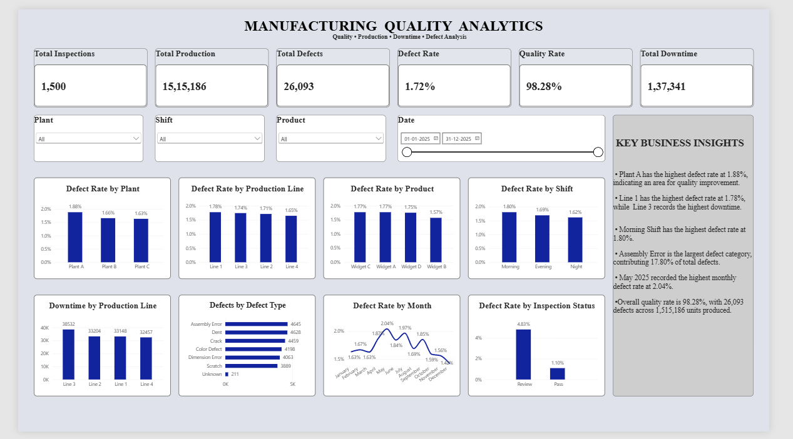

# Manufacturing Quality Analytics

## Project Overview

Manufacturing Quality Analytics is an end-to-end data analytics project focused on analyzing manufacturing inspection, production, defect, downtime, and process-quality data.

The project follows a complete analytics workflow:

**Excel → SQL → Python → Power BI → GitHub**

The objective is to transform raw manufacturing data into meaningful business insights that can help identify quality issues, production patterns, defect trends, downtime patterns, and areas requiring further investigation.

---

## Business Objective

The main objectives of this project are to:

- Analyze manufacturing inspection data
- Measure production and defect performance
- Calculate overall defect and quality rates
- Compare quality performance across plants
- Analyze production-line performance
- Identify product-level quality patterns
- Compare performance across shifts
- Analyze defect types
- Track monthly defect-rate trends
- Analyze machine/process parameters
- Examine downtime patterns
- Identify unusual process values and potential outliers
- Build an interactive Power BI dashboard for business reporting

---

## Tools & Technologies

### Excel
- Data Cleaning
- Data Validation
- Missing Value Handling
- Duplicate Removal
- Data Standardization
- Outlier Identification
- Pivot Tables
- KPI Analysis

### SQL
- MySQL
- Data Exploration
- Aggregations
- GROUP BY
- CASE Statements
- Window Functions
- RANK()
- Business KPI Analysis
- Quality Analysis

### Python
- Python 3.13
- Pandas
- NumPy
- Matplotlib
- Seaborn
- Jupyter Notebook
- Exploratory Data Analysis
- Data Visualization
- Correlation Analysis
- Outlier Analysis

### Power BI
- Data Modeling
- DAX
- KPI Cards
- Interactive Slicers
- Column Charts
- Bar Charts
- Line Charts
- Dashboard Design
- Business Insights

### GitHub
- Project Version Control
- Repository Management
- Documentation
- Portfolio Presentation

---

## Dataset

The dataset contains manufacturing inspection records covering the year **2025**.

### Dataset Size

- **1,500 unique inspections**
- **23 columns**

### Main Columns

| Column | Description |
|---|---|
| Inspection_ID | Unique inspection identifier |
| Inspection_Date | Date of inspection |
| Plant | Manufacturing plant |
| Production_Line | Production line |
| Product | Product being manufactured |
| Shift | Production shift |
| Machine_ID | Machine identifier |
| Operator_ID | Operator identifier |
| Batch_ID | Production batch |
| Production_Qty | Quantity produced |
| Defect_Qty | Number of defective units |
| Defect_Type | Type of defect |
| Downtime_Min | Downtime in minutes |
| Cycle_Time_Sec | Production cycle time |
| Temperature_C | Process temperature |
| Pressure_Bar | Process pressure |
| Vibration_mm_s | Machine vibration |
| Material_Batch | Material batch |
| Supplier | Supplier information |
| Inspection_Status | Inspection result |
| Temperature_Flag | Temperature outlier flag |
| Pressure_Flag | Pressure outlier flag |
| Vibration_Flag | Vibration outlier flag |

---

# Data Cleaning

The raw dataset was intentionally prepared with realistic data-quality issues.

The cleaning process included:

- Removing duplicate records
- Identifying duplicate Inspection IDs
- Handling missing Operator IDs
- Handling missing Supplier values
- Handling missing Defect Types
- Replacing missing process parameters using median values
- Standardizing Plant names
- Standardizing Shift values
- Converting numeric text values into numeric data types
- Verifying date formats
- Creating process-parameter outlier flags
- Validating the final dataset

After cleaning, the dataset contained:

**1,500 unique inspection records**

No duplicate Inspection IDs remained in the final dataset.

---

# Excel Analysis

Excel was used as the first stage of the analytics workflow.

### Excel Tasks

- Raw data inspection
- Data cleaning
- Duplicate detection
- Missing-value handling
- Data standardization
- KPI calculation
- Plant analysis
- Production-line analysis
- Product analysis
- Shift analysis
- Defect-type analysis
- Monthly analysis
- Outlier analysis

### Excel Sheets

The final workbook contains:

- Raw_Data
- Clean_Data
- Data_Quality_Notes
- KPI_Analysis
- Plant_Analysis
- Line_Analysis
- Product_Analysis
- Shift_Analysis
- Defect_Type_Analysis
- Monthly_Analysis
- Outlier_Analysis

---

# SQL Analysis

MySQL was used to perform structured business analysis on the cleaned dataset.

### SQL Analysis Included

- Overall manufacturing KPIs
- Plant-level quality analysis
- Production-line analysis
- Product-level analysis
- Shift-level analysis
- Defect-type analysis
- Monthly defect trends
- High-defect production lines
- Plant and shift combinations
- Top production batches
- Ranking analysis
- Top defect-rate months
- Downtime analysis
- Inspection-status analysis
- Process-parameter analysis
- Multi-flag outlier analysis

### SQL Concepts Used

- SELECT
- WHERE
- GROUP BY
- ORDER BY
- CASE
- Aggregate Functions
- Subqueries
- CTEs
- Window Functions
- RANK()
- Conditional Analysis

---

# Python Analysis

Python was used for exploratory data analysis, statistical analysis, and visualization.

### Libraries Used

- Pandas
- NumPy
- Matplotlib
- Seaborn

### Python Workflow

1. Load cleaned CSV
2. Inspect dataset structure
3. Validate data types
4. Check missing values
5. Check duplicate records
6. Generate descriptive statistics
7. Calculate manufacturing KPIs
8. Analyze plants
9. Analyze production lines
10. Analyze products
11. Analyze shifts
12. Analyze defect types
13. Analyze monthly trends
14. Analyze inspection status
15. Analyze process parameters
16. Detect outliers
17. Analyze correlations
18. Create visualizations
19. Generate business insights

---

# Python Visualizations

The project includes visualizations for:

- Defect Rate by Plant
- Defect Rate by Production Line
- Defect Rate by Product
- Defect Rate by Shift
- Monthly Defect Rate Trend
- Defect Distribution by Type
- Defect Rate by Inspection Status
- Process Parameters by Inspection Status
- Downtime by Production Line
- Correlation Heatmap

All visualizations are stored inside the Python `figures` folder.

---

# Power BI Dashboard

Power BI was used to create the final interactive manufacturing quality dashboard.

The dashboard provides a consolidated view of:

- Production performance
- Quality performance
- Defect trends
- Downtime
- Defect categories
- Inspection status
- Plant performance
- Production-line performance
- Product performance
- Shift performance


## Dashboard Preview




### KPI Cards

The dashboard contains six main KPIs:

| KPI | Value |
|---|---:|
| Total Inspections | 1,500 |
| Total Production | 1,515,186 |
| Total Defects | 26,093 |
| Defect Rate | 1.72% |
| Quality Rate | 98.28% |
| Total Downtime | 137,341 min |

### Interactive Filters

The dashboard includes slicers for:

- Plant
- Shift
- Product
- Inspection Date

Users can interact with these filters to analyze specific parts of the manufacturing process.

---

# Key Business Insights

### Overall Performance

The dataset contains **1,500 inspections** covering **1,515,186 units of production**.

A total of **26,093 defects** were recorded.

The overall defect rate was:

**1.72%**

The corresponding quality rate was:

**98.28%**

Total recorded downtime was:

**137,341 minutes**

---

### Plant Analysis

Plant A recorded a defect rate of **1.88%**.

Plant B recorded a defect rate of **1.66%**.

Plant C recorded a defect rate of **1.63%**.

Plant A also recorded the highest total downtime at **47,099 minutes**.

---

### Production-Line Analysis

The defect rates across production lines were:

- Line 1 — **1.78%**
- Line 2 — **1.71%**
- Line 3 — **1.74%**
- Line 4 — **1.65%**

Line 1 recorded the highest defect rate.

Line 3 recorded the highest downtime at **38,532 minutes**.

---

### Product Analysis

Product defect rates were:

- Widget A — **1.77%**
- Widget B — **1.57%**
- Widget C — **1.77%**
- Widget D — **1.75%**

Widget B recorded the lowest defect rate.

Widget C recorded the highest production quantity and highest number of defects.

---

### Shift Analysis

Defect rates by shift were:

- Morning — **1.80%**
- Evening — **1.69%**
- Night — **1.62%**

The Morning shift recorded the highest defect rate.

The Night shift recorded the lowest defect rate.

---

### Defect-Type Analysis

The major defect categories were:

| Defect Type | Defect % |
|---|---:|
| Assembly Error | 17.80% |
| Dent | 17.74% |
| Crack | 17.09% |
| Color Defect | 16.09% |
| Dimension Error | 15.57% |
| Scratch | 14.90% |
| Unknown | 0.81% |

Assembly Error represented the largest share of recorded defects.

---

### Inspection Status Analysis

Inspection status showed a noticeable difference in defect rates:

| Inspection Status | Defect Rate |
|---|---:|
| Pass | 1.10% |
| Review | 4.83% |

Records marked for Review had a higher defect rate than records marked Pass.

Process-parameter averages were also slightly higher for Review records.

---

### Monthly Analysis

Monthly defect rates varied throughout 2025.

The highest monthly defect rate occurred in **May 2025 at approximately 2.04%**.

The lowest monthly defect rate was approximately **1.42% in December 2025**.

The monthly trend can be monitored through the Power BI dashboard and Python analysis.

---

# Outlier Analysis

Process parameters were checked for unusual values.

### Temperature

- Normal: **1,497**
- Investigate: **3**

### Pressure

- Normal: **1,498**
- Investigate: **2**

### Vibration

- Normal: **1,497**
- Investigate: **3**

Outliers were **flagged rather than deleted** so they could be investigated as potential process-quality issues.

---

# Business Value

This project demonstrates how manufacturing data can be transformed into actionable analytical information.

The analysis can support:

- Quality monitoring
- Defect reduction initiatives
- Production performance tracking
- Downtime monitoring
- Process parameter monitoring
- Shift-level quality analysis
- Production-line comparison
- Defect-category analysis
- Operational decision-making

The Power BI dashboard provides an interactive reporting layer that allows users to explore quality performance using different filters.

---

# Project Workflow

```text
Raw Manufacturing Data
          ↓
      Excel Cleaning
          ↓
   Data Quality Checks
          ↓
      Cleaned CSV
          ↓
      MySQL Analysis
          ↓
    Python EDA & Charts
          ↓
     Power BI Dashboard
          ↓
     Business Insights
          ↓
        GitHub
